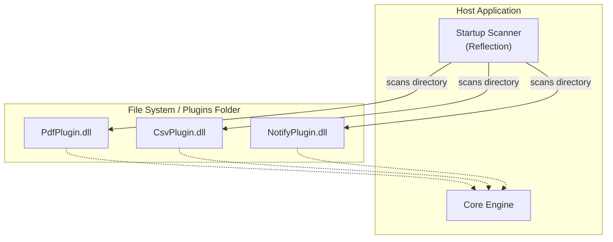

# Technical Design Document: High-Performance Extensible Plugin Architecture

## 1. Executive Summary

This document describes the design and implementation of a modular, high-performance Plugin Architecture for .NET 8+ applications. The system is designed to allow dynamic feature extension without modifying the core codebase, ensuring **O(1)** resolution performance on the hot path and providing robust failure isolation (Safe Fallback).

## 2. Design Goals

| Goal                    | Description                                                                     | Priority |
| ----------------------- | ------------------------------------------------------------------------------- | -------- |
| **Extensibility**       | Add new capabilities via new assemblies (DLLs) dropped into a folder. True OCP. | P0       |
| **High Performance**    | **Zero-allocation** (or near zero) during plugin resolution. O(1) complexity.   | P0       |
| **Safety & Resilience** | A single plugin failure must not crash the request. Support automatic fallback. | P0       |
| **Clean API**           | Simple `IPlugin` interface. No complex setup for consumers.                     | P1       |

## 3. Architecture Overview

The system uses a **Two-Phase Initialization** strategy to balance dynamic discovery with runtime performance.

### 3.1 Component Diagram



### 3.2 Dynamic Discovery & Isolation

Instead of referencing plugin projects directly, the Host Application defines a contract (`IPlugin`) and scans a specific directory (`./plugins`) at startup.

1.  **Assembly Loading**: Using `Assembly.LoadFrom` (or `AssemblyLoadContext` for deeper isolation) to load DLLs.
2.  **Type Registry**: The `CoreEngine` extracts all classes implementing `IPlugin` and registers them into the high-performance `PluginRegistry`.

## 4. Implementation Details

### 4.1. The "Zero-Allocation" Registry

To prevent memory churn during high-throughput requests, we avoid `LINQ` and `IEnumerable` resolution at runtime.

- **Phase 1 (Startup)**:
  - Scan `./plugins` folder.
  - Initialize `FrozenDictionary<string, IPlugin[]>`.
  - Plugins are pre-sorted by `Priority` (Descending) and `Version`.
- **Phase 2 (Runtime)**:
  - `GetOptimizationPlan` returns `ReadOnlyMemory<IPlugin>`.
  - This is a struct (value type) copy, causing **zero heap allocation**.

### 4.2. Chain of Responsibility & Fallback

The Engine implements a resilient execution pipeline:

```csharp
// Simplified Logic
for (int i = 0; i < candidates.Length; i++)
{
    try {
        if (await candidates.Span[i].ExecuteAsync(ctx)) return;
    } catch (Exception ex) {
        // Log & proceed to next candidate
        continue;
    }
}
```

## 5. Performance Analysis

### Complexity

- **Resolution**: **O(1)**. Accessing `FrozenDictionary` is constant time.
- **Iteration**: **O(N)** where N is the number of installed plugins for _that specific capability_. typically N < 5.

### Memory

- **Heap Allocations**: **0** per request for the resolution logic.
- **Stack Allocations**: Minimal (Struct iterators for Span/Memory).

## 6. Physical Separation Benefits

By moving plugins to separate DLLs:

1.  **Independent Deployment**: Can update `PdfPlugin.dll` without restarting the entire build pipeline of Core.
2.  **Dependency Isolation**: Reduces risk of conflicting versions (if combined with ALC).
3.  **Security**: Can restrict plugin permissions in the future.
4.  **Vendor Neutrality**: 3rd parties can build plugins without source code access to Core.
